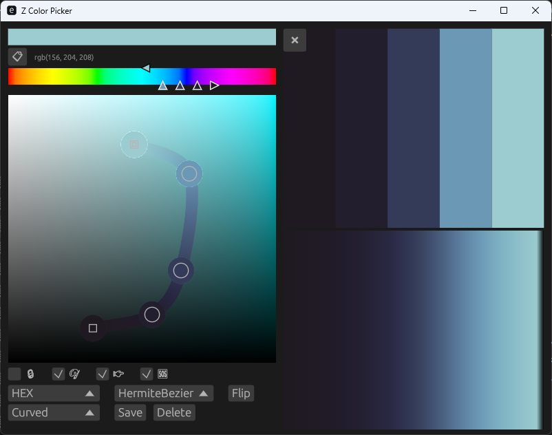

# Z-Color-Picker

# MAIN FEATURES

- Easy creation of gradients
- Interactive ui
- Gradient preview
- Multiple Spline Modes
- Create/Save/Load Presets
- Coded in Rust

# HOW TO

## Usage

Each control point is a value in a color space (currently only HSV).
Hue of each individual control point can be changed in the hue bar, and saturation & value in the 2d slider.
The control-points color is shown in the top left, and underneath displays a gradient using the selected spline mode.
To create a new preset, click the preset combo box and select NEW

## Controls

- Double-click-M1: Add control-point
- Right-click-M2: Remove control-point
- Middle-click: Copy color as in the selected format (only on certain widgets for now)
- F11/F12: Debug windows

## Options

- Lock: Apply any control point coordinate translation to all control points
- Auto Hue: Select hue for start/end control points, middle control point's hue is automatically selected
- Insert Direction: Change the append direction on adding new control point
- Control Points Constrain: Constrains control-points values to their maximum (this will deform your spline "shape" if any control point touches the edge of any slider)

# TODO:

## TODO: Bugs

- HermiteBezier, can not modify t's in previewer
- Polynomial

## TODO: Features

- Add confirm window for Delete Preset button
- Add confirm window for exiting when having an unsaved preset active.
- Color Lerp
- Regular Color pick for control points
- Visualization curves
  - Value
  - Saturation
  - Hue
- User visual feedback when copying color values
- View multiple presets at the same time
- Middle mouse to copy color from anywhere within the application.
- Import curves to photoshop????
- Different color spaces
- Better ui widget dynamic rezising
- Preset save more data, lock/etc...
- Size slider for color picker spline
- Option to auto load last preset or not.
